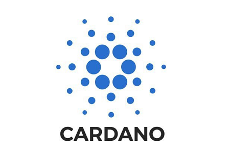

<a href="https://nft-dao.org/">

# NFT-DAO Governance HOLON

## Participate in our Discussions :
[Welcome !](https://github.com/NFT-DAO/Governance-HOLON/discussions/50)

## Meetings
Meeting Minutes are recorded in [Discussions](https://github.com/NFT-DAO/Governance-HOLON/discussions/categories/meetings). To allow for threaded comments.

## Project Catalyst
<a href="https://cardano.ideascale.com/a/index">
<a href="https://cardano.org/">

[Ideas Contributed on ideascale by **NFT-DAO (the whole team)** - Project Catalyst](https://cardano.ideascale.com/a/pmd/3071109-48088?)  

1. **[Contribution Token Governance Model](https://cardano.ideascale.com/a/dtd/Contribution-Token-Governance-Model/352773-48088)** - [Discussion](https://github.com/NFT-DAO/Governance-HOLON/discussions/54)
1. **[NFTDAO: Industry Standards 1](https://cardano.ideascale.com/a/dtd/NFTDAO-Industry-Standards-1/352362-48088)** - [Discussion](https://github.com/NFT-DAO/Governance-HOLON/discussions/56)
1. **[CNS as NFT (Cardano Name Service)](https://cardano.ideascale.com/a/dtd/CNS-as-NFT-Cardano-Name-Service/352159-48088)** - [Discussion](https://github.com/NFT-DAO/Governance-HOLON/discussions/57)
2. **[Ticket Dispenser—NFT Framework DApp ](https://cardano.ideascale.com/a/dtd/Ticket-Dispenser%E2%80%94NFT-Framework-DApp/352152-48088)** - [Discussion](https://github.com/NFT-DAO/Governance-HOLON/discussions/58)
3. **[Interoperable NFTs across chains ](https://cardano.ideascale.com/a/dtd/Interoperable-NFTs-across-chains/352132-48088)** - [Discussion](https://github.com/NFT-DAO/Governance-HOLON/discussions/59)
4. **[Stripe-like Wallet Connector ](https://cardano.ideascale.com/a/dtd/Stripe-like-Wallet-Connector/352126-48088)** - [Discussion](https://github.com/NFT-DAO/Governance-HOLON/discussions/60)
5. **[NFT-DAO EZ-on ](https://cardano.ideascale.com/a/dtd/NFT-DAO-EZ-on/341773-48088)** - [Discussion](https://github.com/NFT-DAO/Governance-HOLON/discussions/61)
6. **[NFT-DAO NFT metadata standards ](https://cardano.ideascale.com/a/dtd/NFT-DAO-NFT-metadata-standards/341012-48088)**- [Discussion](https://github.com/NFT-DAO/Governance-HOLON/discussions/62)

## Documents
For documents not related to NFT-DAO's Business Plan go to [Documents](/Documents/). Each folder will have its own README to guide users further. Each sections description should be no more than a few sentences.

## Business Plan
[A summary of the contents of the **Business Plan** section may be found here](Business-Plan/Summary.md)

# Projects
[Project Overview](https://github.com/NFT-DAO/Governance-HOLON/projects) 

## NFT DAO Fund 3 Deliverables & Projected Costs Governance
> Break Deliverables down into weekly tasks

[Project Board](https://github.com/NFT-DAO/Governance-HOLON/projects/2)

## Genesis of the Governance HOLON GitHub
This repository originates from the community of contributers to [Comprehensive NFT Framework Collab](https://cardano.ideascale.com/a/dtd/Comprehensive-NFT-Framework-Collab/334521-48088), a [Project Cataylyst](https://cardano.ideascale.com/) proposal that contributes to the future of [Cardano](https://cardano.org/).

## To participate in the NFT-DAO Governance HOLON GitHub :
* Submit issues
* Fork this repository
* Submit Pull Requests

-----------------------------

